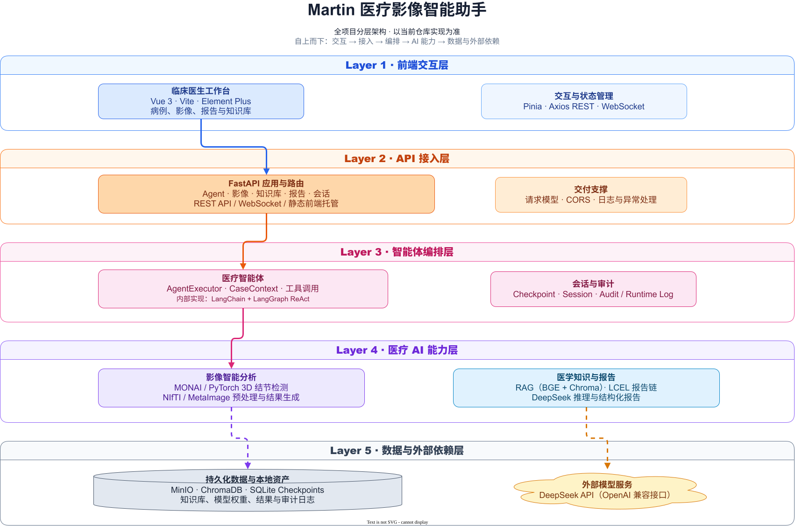
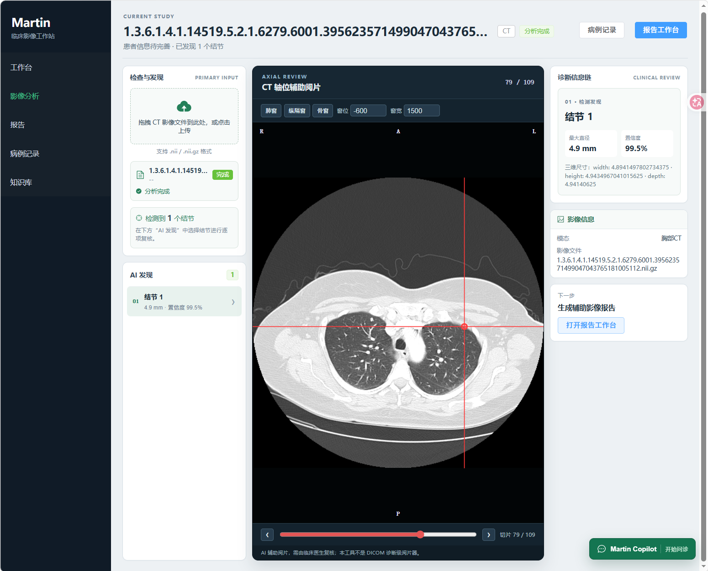
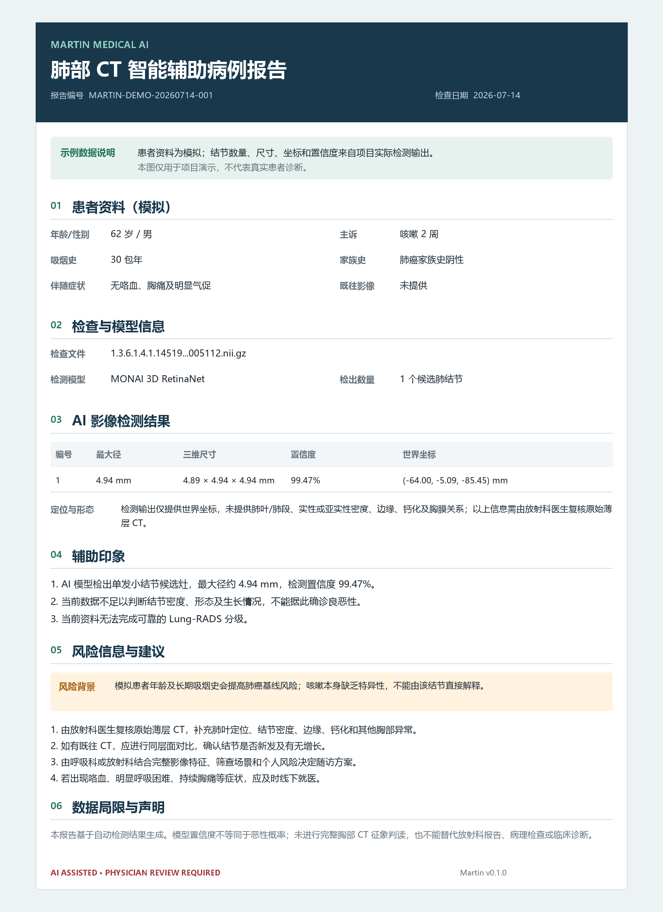
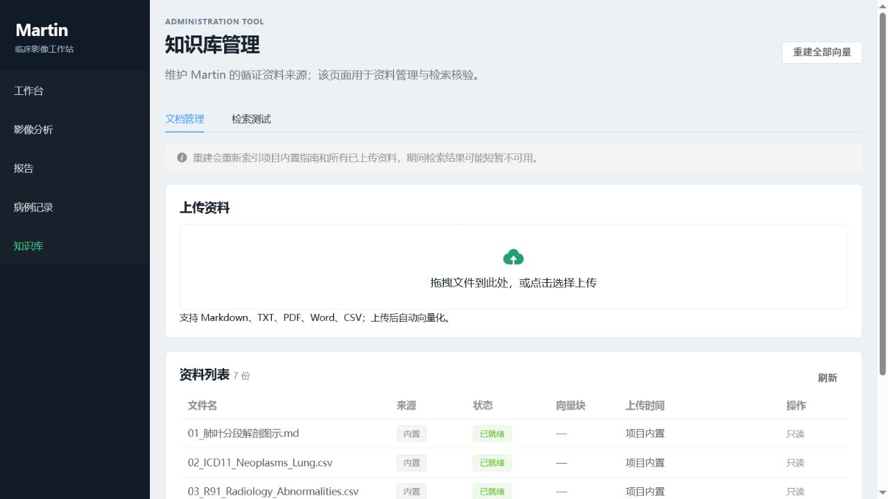
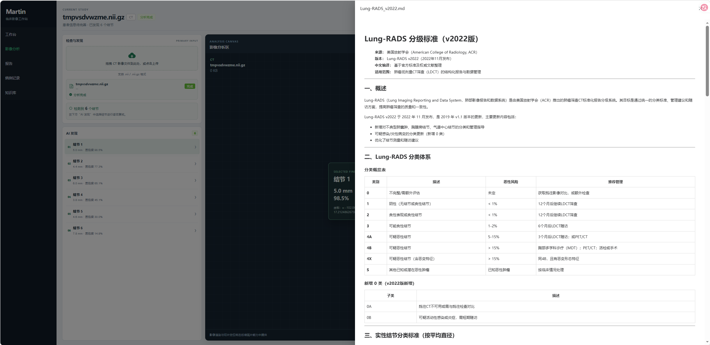
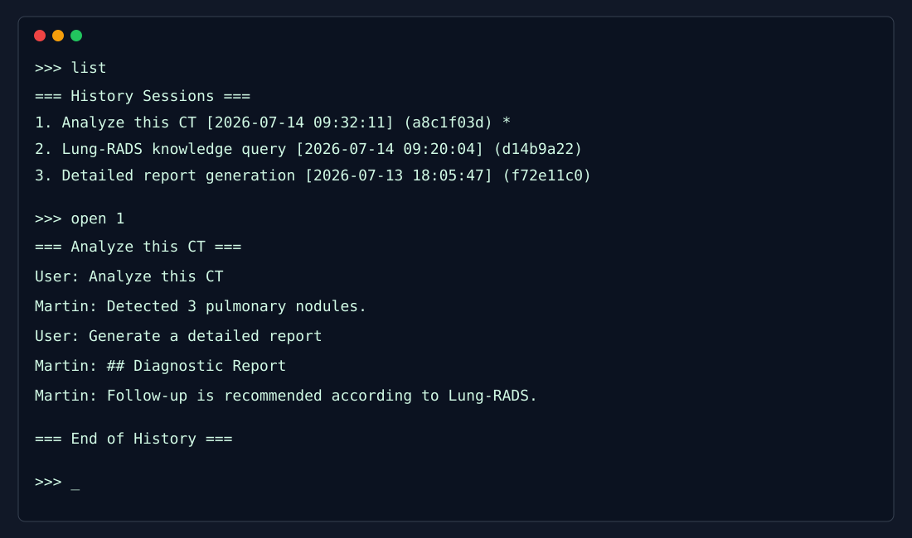

# Martin — AI Medical Imaging Copilot for Clinicians

> 面向临床医生的 AI 医学影像辅助分析智能体：MONAI 影像检测 + RAG 知识增强 + LangChain Agent 编排 + DeepSeek 推理

Martin 是一个开源的医学影像 AI Copilot，面向**呼吸科 / 胸外科 / 影像科医生**，以肺结节检测为切入点，实现从**影像感知 → 知识检索 → 智能推理 → 报告生成**的完整辅助分析流程。

**核心定位：** 不是面向患者的医疗聊天机器人，而是医生工作流的 AI 影像辅助分析智能体。

---

## ✨ Features

- 👁 **3D 肺结节检测** — 基于 MONAI RetinaNet，支持 NIfTI / MetaImage 格式
- 🔍 **RAG 循证诊断** — ChromaDB + BGE 本地向量库，引用 Lung-RADS 等权威指南
- 🤖 **Agent 智能编排** — LangChain `create_agent`，多工具自主规划、调用与会话持久化
- 🧠 **会话级病例上下文** — `CaseContext` 按 `thread_id` 持久化患者信息、影像、结节、知识摘要与临床备注
- 📄 **多类型报告生成** — brief / detailed / research 三档，LCEL 声明式编排
- 💾 **会话与病例恢复** — 官方 `SqliteSaver` 保存历史会话；Web“病例记录”可恢复原会话并继续分析、生成报告
- 🌐 **临床影像工作站** — Vue 3 + FastAPI 三栏工作区（检查与发现 / 影像分析区 / 诊断信息链），Martin 作为可收起 Copilot
- 📎 **CT 上传与分析** — 左侧检查栏提供主上传入口；Copilot 中保留附件上传作为补充入口
- ⚡ **WebSocket 实时过程** — AgentTimeline 展示工具调用、观察结果、推理状态
- 🗄 **MinIO 对象存储** — 医学影像文件统一存储，CaseContext 关联 file_id
- 📚 **知识库原文查看** — 知识摘要以引用条目展示，点击"查看原文"弹出 Drawer 阅读完整指南文档
- 📝 **医疗审计溯源** — reasoning 字段 + JSONL 审计日志，全程可追溯
- 🖥 **GPU 加速推理** — CUDA 加速，支持本地模型部署

---

## 🏗 Architecture




**两层记忆架构：**

| 层级 | 实现 | 作用 |
|------|------|------|
| 对话记忆 | LangGraph `SqliteSaver` | 保存完整消息历史与 LangGraph checkpoint，支持重启恢复 |
| 病例记忆 | `CaseContext`（同一 checkpoint 的结构化状态） | 患者信息 / 影像 / 结节 / 知识摘要 / 临床备注 / 检测完成状态 |

---

## 🔄 Workflow

```
临床医生在 Vue 工作台上传 CT / 提出病例问题
  ↓  REST `/api/agent/chat` 或 WebSocket `/api/ws/agent/{session_id}`
FastAPI 路由接收请求，并按 session_id 取得 AgentExecutor
  ↓
AgentExecutor.invoke()
  ├─ 从 SQLite LangGraph checkpoint 恢复 CaseContext
  ├─ 注入动态病例上下文与系统提示词
  └─ LangChain `create_agent` 驱动的 LangGraph ReAct 循环：
       1. DeepSeek 判断是否需要工具
       2. 调用影像分析 / 知识检索 / 报告生成 / 更新病例 / MinIO 上传下载
       3. 工具结果写入 ToolMessage，必要时继续推理
       4. 生成最终临床辅助回答
  ↓
同步 CaseContext、保存 checkpoint 并写入审计 / 运行日志
  ↓
REST 返回结果或 WebSocket 推送工具状态、回答与报告
```

---

## 🛠 Tech Stack

| Component | Technology |
|-----------|------------|
| Agent 框架 | LangChain `create_agent` + LangGraph 运行时 |
| Web 前端 | Vue 3 + Vite + Pinia + Element Plus |
| Web 后端 | FastAPI + REST + WebSocket |
| 实时通信 | WebSocket（Agent 工具调用过程推送） |
| 对象存储 | MinIO（医学影像文件存储） |
| LLM | DeepSeek API（兼容 OpenAI 协议） |
| RAG 向量库 | ChromaDB（本地持久化） |
| 知识库原文 | `knowledge_base/` 目录（Markdown 格式），`GET /api/knowledge/document/{filename}` |
| Embedding | BGE-Small-ZH-v1.5（本地部署） |
| 视觉模型 | MONAI RetinaNet 3D |
| 深度学习 | PyTorch + CUDA |
| 图像格式 | NIfTI / MetaImage / DICOM |
| 审计日志 | JSONL |

---

## 🚀 Installation

### 环境要求

- Python ≥ 3.10
- PyTorch ≥ 2.0 + CUDA（推荐）
- ≥ 8GB GPU 显存
- Node.js ≥ 18（构建 Web 前端时需要）

### 安装步骤

```bash
# 克隆项目
git clone <repo-url>
cd medical_ai_agent

# 创建虚拟环境（推荐 conda）
conda create -n martin python=3.10
conda activate martin

# 安装 PyTorch（CUDA 版）
pip install torch torchvision torchaudio --index-url https://download.pytorch.org/whl/cu118

# 安装项目依赖
pip install -r requirements.txt

# 配置环境变量
export DEEPSEEK_API_KEY="your-api-key"
export DEEPSEEK_BASE_URL="https://api.deepseek.com/v1"
```

### 下载模型

1. **MONAI 检测模型**：从 MONAI Model Zoo 下载 `lung_nodule_ct_detection`，放入 `models/vision/`
2. **BGE 嵌入模型**：下载 `bge-small-zh-v1.5`，放入 `models/embedding/`

### 导入知识库

```bash
python scripts/import_knowledge.py
```

---

## ⚡ Quick Start

### 方式 1：Agent 对话模式

```bash
# 推荐：显式启动带会话管理的多轮 Agent
python -m martin agent

# 兼容入口：也会启动同一套交互式 Agent
python main.py
```

启动后可在对话中直接提问，Agent 会自主决定调用工具：

| 用户提问 | Agent 行为 |
|---------|-----------|
| "8mm的结节是怎么样的" | → `retrieve_knowledge(query=...)` 检索知识库 |
| "分析这张CT: data/test.nii.gz" | → `analyze_image` → `retrieve_knowledge` → `generate_report` |
| "患者55岁男性，吸烟10年" | → `update_case_context` 更新病例信息 |

Agent 会模拟医生门诊的沟通方式：先了解就诊原因和患者信息，再结合 CT 检测、医学知识库完成解释与病例报告。它会明确说明自己是 AI 智能体，不代替执业医生诊断。普通中文或英文都直接输入；只有以 `/` 开头的内容才作为系统命令处理。

> 工具调用详情和推理过程写入 `log/agent_thinking/YYYY-MM-DD.log`；模型日志、第三方警告和进度条写入 `log/runtime/YYYY-MM-DD.log`，不会进入问诊界面。

### 方式 2：命令行检测

```bash
# 检测结节
python -m martin detect -i data/ct.nii.gz -o results/detection.json

# 生成报告
python -m martin case -i results/detection.json -o report.md --type detailed
```

### 方式 3：Web Copilot 工作台（推荐）

Martin Web 端已升级为**面向医生的 AI 医学影像辅助分析工作站**。主工作区围绕病例审阅与诊断依据组织，Martin 对话助手按需展开，不再以聊天窗口作为页面中心。

首次运行或前端代码更新后，先构建 Vue 页面：

```bash
cd frontend
npm install
npm run build
cd ..
```

然后在上一步创建并安装依赖的环境中启动 Martin Web 服务：

```bash
# 使用安装步骤中创建的 Conda 环境
conda activate martin
python -m martin web

# 或在任意已激活的 Python 虚拟环境中直接执行
python -m martin web
```

需要使用 CT 文件上传或 OSS 影像分析时，先安装 MinIO 并在独立终端启动本机服务：

```bash
minio server ./data/minio --console-address ":9001"
```

### 运行效果

**新版临床影像工作站：点击左侧“结节 1”，即可自动跳转到对应中心层，并以红色十字线和边界框定位 AI 检测候选；可在中央区域继续进行 CT 轴位复核。**



> 截图使用无患者身份信息的演示病例；当前“影像分析区”展示 AI 的结构化发现，不伪装为真实 CT 切片阅片器。

**基于 CaseContext 生成的辅助分析报告：**



**知识库文档管理：内置指南、资料来源、向量化状态和上传入口集中管理。截图仅展示项目内置资料。**




**查看知识库原文（Drawer 展示 Markdown 原文档）：**



**CLI 历史会话查看：**



---

## 🗂️ 会话历史与病例恢复

Agent 会将会话保存到 `data/sessions.sqlite`（LangGraph 官方 `SqliteSaver` 管理），应用重启后仍可继续查看历史会话。每个会话以 `thread_id` 隔离；病例上下文与消息历史随同 checkpoint 保存。

| 命令 | 功能 |
|------|------|
| `/list` | 列出所有历史会话 |
| `/open <编号>` | 查看指定会话的完整对话记录 |
| `/switch <编号>` | 切换到指定会话并继续对话 |
| `/new` | 创建并切换到新会话 |
| `/back` | 返回当前会话 |
| `/help` | 查看系统命令帮助 |
| `/exit` | 退出并保存会话 |

例如，输入 `list` 会作为自然语言交给 Agent；输入 `/list` 才会列出历史会话。未知的斜杠命令会显示“不支持的系统命令”。

Web 端的“病例记录”提供同样的会话恢复能力：选择“继续分析”后，前端请求会话详情并恢复消息与 `CaseContext`。其中包含的影像路径、结节列表和检测完成状态会重建为报告输入，因此可从历史病例直接进入“报告工作台”继续生成报告。为兼容早期 SQLite 数据，已有结节列表的旧会话也会被识别为已检测。

## 📚 Documentation

| 文档 | 说明 |
|------|------|
| [🏗 Architecture](docs/ARCHITECTURE.md) | 系统架构设计、模块职责、数据流 |
| [🛠 Development](docs/DEVELOPMENT.md) | 开发过程、技术决策、踩坑记录 |
| [📚 Learning Summary](docs/LEARNING_SUMMARY.md) | 学习笔记与心得体会 |
| [📖 Learning Guide](docs/LEARNING_GUIDE.md) | 当前代码调用链、模块作用与学习顺序 |
| [🧹 Cleanup Audit](docs/CLEANUP_AUDIT.md) | 重复测试、假通过风险和文件清理候选 |
| [🗺 Roadmap](docs/ROADMAP.md) | 未来规划与演进路线 |
| [🌐 Agent Flow](docs/agent_flow.html) | 交互式 Agent 调用流程可视化（浏览器打开） |

---

## 🗺 Future Work

| 状态 | 方向 | 说明 |
|------|------|------|
| ✅ | 单模态肺结节检测 | MONAI RetinaNet 3D |
| ✅ | RAG 知识增强 | ChromaDB + BGE 本地向量库 |
| ✅ | Agent 多轮对话 | LangGraph + SqliteSaver |
| ✅ | 结构化病例记忆 | CaseContext |
| ✅ | Session 持久化 | SqliteSaver + CLI 历史管理 |
| 🔲 | 多模态融合 | 融合 DICOM 元数据、病理报告等 |
| 🔲 | 多 Agent 协作 | 检测 Agent + 诊断 Agent + 报告 Agent |
| 🔲 | 分割能力 | 增加结节分割与体积测量 |
| ✅ | Web UI | Vue 3 + FastAPI 临床影像工作站、可收起 Copilot、病例恢复与报告续写 |
| ✅ | 知识库管理 | Web 上传、自动向量化、删除与全量重建 |
| 🔲 | 批量处理 | 支持队列批量分析 |

---

## 📄 License

MIT License
