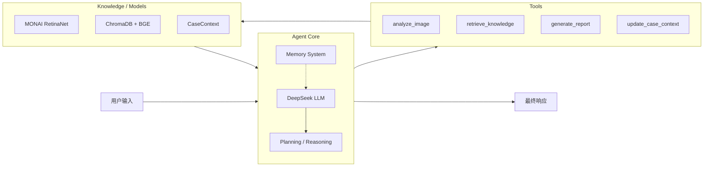

# Martin — Medical AI Agent

> 面向肺部 CT 的智能体：MONAI 影像检测 + RAG 知识增强 + LangChain Agent 编排 + DeepSeek 推理

Martin 是一个开源的医学影像 AI Agent，以肺结节检测为切入点，实现从**影像感知 → 知识检索 → 智能推理 → 报告生成**的完整诊断辅助流程。

---

## ✨ Features

- 👁 **3D 肺结节检测** — 基于 MONAI RetinaNet，支持 NIfTI / MetaImage 格式
- 🔍 **RAG 循证诊断** — ChromaDB + BGE 本地向量库，引用 Lung-RADS 等权威指南
- 🤖 **Agent 智能编排** — LangChain 1.x + LangGraph，多工具自主规划与调用
- 🧠 **结构化病例记忆** — CaseContext 两层记忆架构，Token 高效利用
- 📄 **多类型报告生成** — brief / detailed / research 三档，LCEL 声明式编排
- 💾 **会话持久化** — SqliteSaver + 历史管理，`/list`、`/open`、`/switch`，重启不丢失
- 📝 **医疗审计溯源** — reasoning 字段 + JSONL 审计日志，全程可追溯
- 🖥 **GPU 加速推理** — CUDA 加速，支持本地模型部署

---

## 🏗 Architecture



**两层记忆架构：**

| 层级 | 实现 | 作用 |
|------|------|------|
| 对话记忆 | LangGraph MemorySaver | 保存完整消息历史 |
| 病例记忆 | CaseContext（结构化） | 患者信息 / 结节数据 / 知识摘要 / 临床备注 |

---

## 🔄 Workflow

```
用户输入
  ↓
AgentExecutor.invoke()
  ├─ 注入结构化病例上下文 (CaseContext)
  └─ LangGraph 循环：
       1. LLM 推理 → 是否调用工具
       2. 有 tool_calls → 执行 @tool 函数
       3. 工具结果 → ToolMessage → 返回 LLM
       4. 循环直到生成最终回答
  ↓
同步病例上下文 + 审计日志
  ↓
输出结果
```

---

## 🛠 Tech Stack

| Component | Technology |
|-----------|------------|
| Agent 框架 | LangChain 1.x + LangGraph |
| LLM | DeepSeek API（兼容 OpenAI 协议） |
| RAG 向量库 | ChromaDB（本地持久化） |
| Embedding | BGE-Small-ZH-v1.5（本地部署） |
| 视觉模型 | MONAI RetinaNet 3D |
| 深度学习 | PyTorch + CUDA |
| 图像格式 | NIfTI / MetaImage |
| 审计日志 | JSONL |

---

## 🚀 Installation

### 环境要求

- Python ≥ 3.10
- PyTorch ≥ 2.0 + CUDA（推荐）
- ≥ 8GB GPU 显存

### 安装步骤

```bash
# 克隆项目
git clone <repo-url>
cd medical_ai_agent

# 创建虚拟环境（推荐 conda）
conda create -n martin python=3.10
conda activate martin

# 安装 PyTorch（CUDA 版）
pip install torch torchvision torchaudio --index-url https://download.pytorch.org/whl/cu118

# 安装项目依赖
pip install -r requirements.txt

# 配置环境变量
export DEEPSEEK_API_KEY="your-api-key"
export DEEPSEEK_BASE_URL="https://api.deepseek.com/v1"
```

### 下载模型

1. **MONAI 检测模型**：从 MONAI Model Zoo 下载 `lung_nodule_ct_detection`，放入 `models/vision/`
2. **BGE 嵌入模型**：下载 `bge-small-zh-v1.5`，放入 `models/embedding/`

### 导入知识库

```bash
python scripts/import_knowledge.py
```

---

## ⚡ Quick Start

### 方式 1：Agent 对话模式

```bash
python main.py
```

启动后可在对话中直接提问，Agent 会自主决定调用工具：

| 用户提问 | Agent 行为 |
|---------|-----------|
| "8mm的结节是怎么样的" | → `retrieve_knowledge(query=...)` 检索知识库 |
| "分析这张CT: data/test.nii.gz" | → `analyze_image` → `retrieve_knowledge` → `generate_report` |
| "患者55岁男性，吸烟10年" | → `update_case_context` 更新病例信息 |

Agent 会模拟医生门诊的沟通方式：先了解就诊原因和患者信息，再结合 CT 检测、医学知识库完成解释与病例报告。它会明确说明自己是 AI 智能体，不代替执业医生诊断。普通中文或英文都直接输入；只有以 `/` 开头的内容才作为系统命令处理。

> 工具调用详情和推理过程写入 `log/agent_thinking/YYYY-MM-DD.log`，不干扰对话界面。

### 方式 2：命令行检测

```bash
# 检测结节
python -m martin detect -i data/ct.nii.gz -o results/detection.json

# 生成报告
python -m martin case -i results/detection.json -o report.md --type detailed
```

### 运行效果

基于模拟问诊资料和项目实际检测输出生成的完整病例报告：


患者信息在图片中明确标注为模拟，结节数量、尺寸、坐标和置信度来自项目实际运行数据。可运行 `python scripts/render_case_report_demo.py` 重新生成固定尺寸 PNG，缩放时不会发生 SVG 字体重叠。

历史会话查看效果：


---

## 🗂️ 会话历史

Agent 会将会话保存到 `data/sessions.sqlite`（LangGraph 官方 `SqliteSaver` 管理），应用重启后仍可继续查看历史会话。

| 命令 | 功能 |
|------|------|
| `/list` | 列出所有历史会话 |
| `/open <编号>` | 查看指定会话的完整对话记录 |
| `/switch <编号>` | 切换到指定会话并继续对话 |
| `/new` | 创建并切换到新会话 |
| `/back` | 返回当前会话 |
| `/help` | 查看系统命令帮助 |
| `/exit` | 退出并保存会话 |

例如，输入 `list` 会作为自然语言交给 Agent；输入 `/list` 才会列出历史会话。未知的斜杠命令会显示“不支持的系统命令”。

## 📚 Documentation

| 文档 | 说明 |
|------|------|
| [🏗 Architecture](docs/ARCHITECTURE.md) | 系统架构设计、模块职责、数据流 |
| [🛠 Development](docs/DEVELOPMENT.md) | 开发过程、技术决策、踩坑记录 |
| [📚 Learning Summary](docs/LEARNING_SUMMARY.md) | 学习笔记与心得体会 |
| [🗺 Roadmap](docs/ROADMAP.md) | 未来规划与演进路线 |
| [🌐 Agent Flow](docs/agent_flow.html) | 交互式 Agent 调用流程可视化（浏览器打开） |

---

## 🗺 Future Work

| 状态 | 方向 | 说明 |
|------|------|------|
| ✅ | 单模态肺结节检测 | MONAI RetinaNet 3D |
| ✅ | RAG 知识增强 | ChromaDB + BGE 本地向量库 |
| ✅ | Agent 多轮对话 | LangGraph + SqliteSaver |
| ✅ | 结构化病例记忆 | CaseContext |
| ✅ | Session 持久化 | SqliteSaver + CLI 历史管理 |
| 🔲 | 多模态融合 | 融合 DICOM 元数据、病理报告等 |
| 🔲 | 多 Agent 协作 | 检测 Agent + 诊断 Agent + 报告 Agent |
| 🔲 | 分割能力 | 增加结节分割与体积测量 |
| 🔲 | Web UI | 前端可视化交互界面 |
| 🔲 | 批量处理 | 支持队列批量分析 |

---

## 📄 License

MIT License
