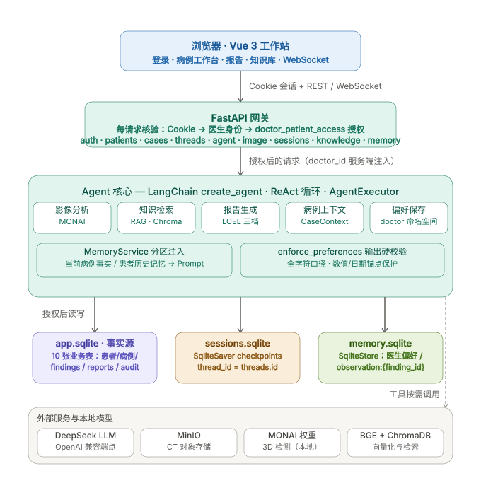

# Martin — 面向临床医生的 AI 医学影像工作站

> 多医生登录 · 患者/病例实体库 · 医学 Agent（MONAI 检测 + RAG 检索 + 报告生成）· 跨会话临床记忆

Martin 是面向**呼吸科 / 胸外科 / 影像科医生**的 AI 医学影像辅助分析系统：医生登录后按患者→病例组织数据，围绕病例与 Agent 对话，完成 **CT 检测 → 知识检索 → 报告生成**，并跨会话记住医生偏好与患者纵向观察。

**核心定位：** 不是面向患者的医疗聊天机器人，而是医生工作流的 AI 辅助分析智能体——所有结论标注数据边界，不做诊断。

---

## ✨ Features

**工作站与多医生协作（Entity V0）**

- 👨‍⚕️ **医生账号与服务端会话** — Argon2id 密码哈希、opaque session（Cookie 存 token、库只存哈希）、HttpOnly/SameSite
- 🧑‍🤝‍🧑 **患者 / 病例 / 会话实体库** — SQLite 10 张表；会话 Thread 由服务端创建并绑定病例，REST/WS 入口统一校验医生归属
- 🔐 **授权访问控制** — `doctor_patient_access` 决定可见性，`read_only` 可读不可写，撤销立即生效；全部变更留审计
- 📋 **临床事实链** — Finding / Attachment / Report 独立成行，**追加保存不覆盖**：不同时间的结节观察按时间序列并存（Demo B 纵向对比的基础）

**医学 Agent 核心**

- 👁 **3D 肺结节检测** — MONAI RetinaNet，NIfTI / MetaImage 格式，MinIO 对象存储
- 🔍 **RAG 循证检索** — ChromaDB + BGE 本地向量库（`models/embedding/bge-small-zh-v1.5` 离线加载）
- 📄 **多档报告生成** — brief / detailed / research，LCEL 编排；测量值缺失输出"未提供"，不编造数字
- 📝 **结构化审计** — 记录工具名称、执行状态和最小依据；不保存完整思维链、原始工具参数或最终回答正文

**跨会话临床记忆（SqliteStore V1，2026-09-30 live 验收通过）**

- 🧠 **医生偏好即硬约束** — "结论前置、200 字以内"这类偏好经服务端保存后成为**输出校验标准**（按全部字符计数），违反自动重写，重写不得改动测量值/日期
- 📈 **患者纵向记忆** — 已确认 Finding 确定性投影为 `observation:{finding_id}`，不同时间点并存；当前病例事实与历史记忆分区注入 Prompt
- 🛡 **故障降级** — 记忆库不可用时明确告知模型与用户，拒绝编造既往数据

**可信记忆治理（V2.1，2026-10-09 合成数据验收通过）**

- 来源区分真实医生消息、直接 API 提交、业务事件及来源不完整的旧记录；偏好与记忆支持修订历史和撤回。
- 未核实临床声明及 Finding 纠正单独标注，展示与确认业务事实的冲突，不自动修改业务事实。
- Exact、Temporal、Semantic 和旧版记忆路径执行授权、来源、状态与时效检查；旧向量不能恢复已撤回条目。
- 在病例工作台右侧点击“长期记忆”，查看来源、修订或撤回条目，设置报告篇幅及复杂病例条件偏好。
- 验收范围与限制见 [V2.1 验收报告](docs/refactor/MARTIN_MEMORY_V21_ACCEPTANCE.md)；V2.2 摘要/预算及 V2.3 并发/指标尚未实施。

**工作站**

- 🌐 Vue 3 + FastAPI 三栏工作区，登录页、病例工作台、报告页、会话历史、知识库管理
- ⚡ WebSocket 实时推送工具调用 / 观察结果；轴位阅片定位（十字线 + 边界框）

---

## 🏗 三库架构（边界见 docs/refactor/ADR-001）



| 库 | 文件 | 职责 |
|---|---|---|
| 业务库（事实源） | `data/app.sqlite` | 10 张表：users / patients / cases / threads / doctor_patient_access / attachments / findings / reports / auth_sessions / case_change_audit |
| 会话库 | `data/sessions.sqlite` | LangGraph `SqliteSaver` checkpoint；`threads.id` 即 checkpoint 的 `thread_id`（一个 UUID 两用） |
| 记忆库 | `data/memory.sqlite` | LangGraph `SqliteStore`：医生偏好、患者纵向观察、病例记忆；由业务库授权后读写 |

删除纪律：删业务 Thread 前必须先删对应 checkpoint，禁止孤儿 checkpoint。

---

## 🚀 Quick Start

### 环境要求

- Python ≥ 3.10；Node.js ≥ 18（构建前端）；GPU + CUDA（仅 MONAI 检测需要）
- 本地 LLM 凭据（火山方舟 ark 端点或任意 OpenAI 兼容服务）

### 1. 安装

```bash
git clone https://github.com/freshmanXzz/medical_ai_agent.git
cd medical_ai_agent

conda create -n martin python=3.10 && conda activate martin
# GPU 环境先装 PyTorch：pip install torch torchvision torchaudio --index-url https://download.pytorch.org/whl/cu118
pip install -r requirements.txt
pip install -e .            # 打包 schema.sql 等资源文件
```

### 2. 配置凭据

```bash
export DEEPSEEK_API_KEY="your-key"        # 火山方舟 ark-... 或其他兼容 key
export DEEPSEEK_BASE_URL="https://ark.cn-beijing.volces.com/api/plan/v3"
export DEEPSEEK_MODEL="deepseek-v4.1-flash"
```

### 3. 建库 + 种子数据

```bash
export MARTIN_SEED_DOCTOR_A_PASSWORD="DoctorA!2026"
export MARTIN_SEED_DOCTOR_B_PASSWORD="DoctorB!2026"
python -m scripts.init_app_db
python -m scripts.seed_entity_v0
```

种子账号：`doctor_a`（授权 P001：病例 C001/C002）、`doctor_b`（授权 P002：病例 C003）。C002 含 8mm 结节 + C001 历史 6mm 对比数据，适合演示纵向记忆。

### 4. 构建前端并启动

```bash
cd frontend && npm install && npm run build && cd ..
python -m martin web          # 默认 127.0.0.1:8000
```

浏览器打开 `http://127.0.0.1:8000` 登录即可。

### 5.（可选，CT 上传检测需要）MinIO 与模型权重

```bash
minio server ./data/minio --console-address ":9001"   # 默认 minioadmin/minioadmin，桶 martin-medical
```

| 模型 | 摆放路径 |
|---|---|
| MONAI 检测权重 | `models/vision/lung_nodule_ct_detection-0.6.8/lung_nodule_ct_detection-0.6.8/models/model.pt`（注意目录嵌套两层） |
| BGE 嵌入模型 | `models/embedding/bge-small-zh-v1.5`（存在则离线加载） |

### 命令行模式（不启 Web）

```bash
python -m martin agent
```

斜杠命令管理会话：`/list` `/open <编号>` `/switch <编号>` `/new` `/exit`；其余输入直接交给 Agent。

---

## 🧪 测试与验收

```bash
python -m pytest -q --basetemp=./.pytest_tmp   # basetemp 规避部分 Windows 临时目录权限问题
```

- 全量基线：**280 passed / 1 skipped / 0 failed**（2026-09-30）
- V2.1 相关回归：**340 passed / 0 failed**（2026-10-09，非完整 CT/知识库测试集）；八类真实模型验收及 UI 操作通过，见对应验收报告
- 真实 LLM 验收脚本：`validation_scripts/`（独立端口 8001 + 隔离三库，不触碰正式数据），用法见该目录 README
- 各阶段验收记录：`docs/refactor/`

**当前已知边界：** 未放置 MONAI 权重时检测返回失败提示；知识库需先上传文档才有检索结果；报告已接入确认业务 Finding，缺失的检测类字段仍为“未提供”。无稳定病灶身份时，历史直径差值不能证明同一病灶生长。

---

## 🗂 文档地图

| 文档 | 内容 |
|---|---|
| [AGENT.md](AGENT.md) | 开发规则：环境原则、代码边界、验证诚实性、Git 安全 |
| [docs/plans/ROADMAP.md](docs/plans/ROADMAP.md) | **权威路线图**：基线、V1.1 待办、全链路实测计划、V2 与远期方向 |
| [docs/plans/REFACTOR_PROGRESS.md](docs/plans/REFACTOR_PROGRESS.md) | 批次执行日志 + 最新交班状态块 |
| [docs/plans/AGENT_HANDOFF_PROTOCOL.md](docs/plans/AGENT_HANDOFF_PROTOCOL.md) | 多 agent 交替开发的双向交接规则 |
| [docs/plans/MARTIN_ENTITY_V0_EXECUTION_PLAN.md](docs/plans/MARTIN_ENTITY_V0_EXECUTION_PLAN.md) | Entity V0 执行计划（决策 / DDL / 分批 / 验收门槛） |
| [docs/refactor/](docs/refactor/) | 各阶段验收记录（Entity V0、SqliteStore V1、live 三场景）与 ADR |
| [docs/ARCHITECTURE.md](docs/ARCHITECTURE.md) / [docs/DEVELOPMENT.md](docs/DEVELOPMENT.md) | 架构设计与开发记录（历史） |
| `LOCAL_NOTES.md`（不入库） | 本机环境事实；换机器不存在属正常，按需自建 |

---

## 🗺 演进状态（详见 ROADMAP）

| 状态 | 里程碑 |
|---|---|
| ✅ | 多医生实体库 + 授权 + 事实链 + checkpoint 联动（Entity V0） |
| ✅ | 跨会话临床记忆：医生偏好硬约束 / 患者纵向观察 / 故障降级（SqliteStore V1） |
| ✅ | 前端登录 + 服务端会话生命周期 |
| ✅ | 报告模板接业务 Finding 回填（V1.1；报告结构完整性限制见阶段记录） |
| 🔲 | MONAI 权重机器上的 UI 全链路实测 |
| ✅ | V2.1 可信记忆治理（限定范围验收） |
| 🔲 | V2.2 记忆增长、摘要与预算；V2.3 质量指标与并发 |

---

## 📄 License

MIT License
